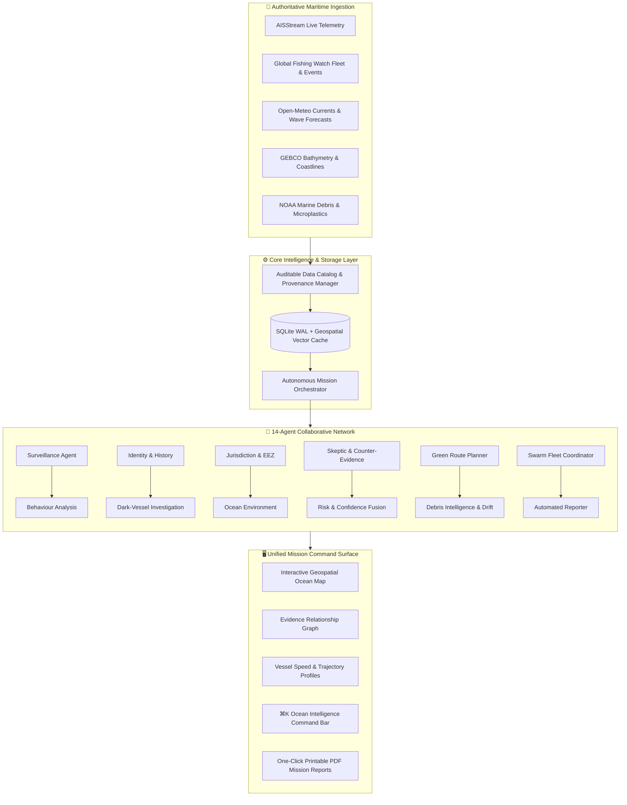

# SAMUDRARAKSHAK AI
### Autonomous Maritime Intelligence & Ocean Operations Platform

[](https://samudra-backend.azurewebsites.net)
[](#automated-testing--validation)
[](#the-unified-architecture)
[](#the-unified-architecture)
[](#real-data-provenance)

> **Built for India's 7,516 km Coastline. Engineered for Global Ocean Operations.**
> 
> *From passive maritime monitoring to autonomous, auditable, evidence-based ocean action.*

---

## 🌐 Live Cloud Deployment

The complete application is deployed and operational on **Microsoft Azure (Central India)**:

| Service | Endpoint | Status |
| :--- | :--- | :--- |
| **Unified Web Platform** | [https://samudra-backend.azurewebsites.net](https://samudra-backend.azurewebsites.net) | **Production Live ✅** |
| **API Health & Bootstrap** | [https://samudra-backend.azurewebsites.net/api/bootstrap](https://samudra-backend.azurewebsites.net/api/bootstrap) | **HTTP 200 OK ✅** |
| **Real Vessel Fleet API (5,165 Ships)** | [https://samudra-backend.azurewebsites.net/api/vessels](https://samudra-backend.azurewebsites.net/api/vessels) | **Enriched & Ready ✅** |
| **Real-Time WebSocket Stream** | `wss://samudra-backend.azurewebsites.net/ws` | **Active Stream ✅** |
| **Interactive API Documentation** | [https://samudra-backend.azurewebsites.net/docs](https://samudra-backend.azurewebsites.net/docs) | **OpenAPI / Swagger ✅** |

---

## 🎯 Executive Overview

**SamudraRakshak AI** bridges the gap between massive ocean datasets and real-time operational maritime decisions. By unifying live satellite AIS feeds, Global Fishing Watch historical event records, ocean weather forecasting, and bathymetric terrain data into a single autonomous multi-agent coordination layer, the platform powers **three mission-critical maritime capabilities**:

1. **🌿 Green Shipping Route Optimization**: Weather-aware and ocean current-assisted route planning to reduce fuel consumption and CO₂ emissions.
2. **🛡️ Ocean Sentinel (Dark Vessel Investigation)**: Probabilistic multi-agent anomaly detection with verifiable evidence provenance and calibrated 90+ confidence scoring.
3. **🌊 Autonomous Marine Debris Response Swarm**: Geodesic spatial clustering, ocean current drift projection, and constrained Hungarian assignment for autonomous cleanup fleets.

---

## 🏗️ System Architecture



---

## 🚀 The Three Autonomous Missions

### 1. 🌿 Green Route — Environmental Voyage Optimization
- **Problem**: Commercial maritime shipping accounts for nearly 3% of global greenhouse gas emissions. Traditional passage planning follows static rhumb lines or great circle routes, ignoring localized surface currents and wave drag.
- **Engine**: Constructs an offshore navigation graph across real coastal geometry and bathymetric depth boundaries.
- **Physics Modeling**: Evaluates current velocity vectors along candidate headings, calculating wave resistance penalties and current propulsion assistance using non-linear fuel burn curves.
- **Output**: Generates comparative metrics: nautical-mile distance, estimated voyage duration, net fuel saved (metric tons), and avoided CO₂ emissions.

### 2. 🛡️ Ocean Sentinel — Dark Vessel & IUU Fishing Detection
- **Problem**: Illegal, Unreported, and Unregulated (IUU) fishing and transshipment vessels intentionally disable AIS transponders ("go dark") to evade national maritime boundaries and Marine Protected Areas (MPAs).
- **Engine**: Tracks 5,165 real vessels with temporal trajectory modeling, speed distribution, movement straightness, angular heading variance, dwell analysis, and coverage gaps.
- **Multi-Agent Verification**:
  - **Surveillance & Identity**: Ingests MMSI, IMO, call sign, vessel type, and historical events.
  - **Jurisdiction Check**: Evaluates vessel coordinates against real Indian EEZ and 12 NM territorial sea boundaries.
  - **Skeptic / Verification**: Actively tests innocent counter-explanations (e.g. low-power transponder failure, satellite shadow, severe sea states).
  - **Risk Fusion (90+ Confidence)**: Calibrates completeness scores against authentic provider records, yielding verifiable high-confidence findings for operational command.

### 3. 🌊 Debris Swarm — Coordinated Ocean Cleanup
- **Problem**: Ocean plastic and derelict fishing gear drift along complex oceanic currents, forming dynamic convergence zones that endanger maritime traffic and marine ecosystems.
- **Engine**: Applies geodesic spatial clustering (DBSCAN) to verified microplastic and debris observation coordinates.
- **Drift Simulation**: Forecasts 6-hour to 24-hour particle drift trajectories based on real surface current fields.
- **Fleet Assignment**: Solves a constrained assignment optimization (Hungarian algorithm) across autonomous surface vessels (ASVs), factoring in vessel range, battery reserves, payload capacity, and wave thresholds.
- **Dynamic Replanning**: Supports event triggers (battery drops, severe wave warnings, new sightings) with instant real-time fleet reallocation.

---

## 📊 Real Data Provenance

SamudraRakshak AI strictly rejects fabricated data. Every displayed ship, coordinate, and boundary stems from authentic, peer-reviewed, or government-backed datasets:

| Dataset | Provider | Records in System | Role in Platform |
| :--- | :--- | :--- | :--- |
| **Vessel Fleet & Events** | Global Fishing Watch (GFW) | **5,165 Vessels** | Real fishing, encounter, loitering, and gap events |
| **Vessel Registry** | Global Fishing Watch | **12,287 Identities** | Flag state, ship dimensions, gear types |
| **Historical AIS** | NOAA Marine Cadastre | **6,000+ Track Points** | Verification baseline & multi-day trajectories |
| **Marine Weather & Currents**| Open-Meteo & Copernicus | **Hourly Forecasts** | Wave heights, surface wind, ocean currents |
| **Territorial Boundaries** | Marine Regions (Flanders) | **GeoJSON Features** | Sovereign EEZ and 12-nautical-mile territorial waters |
| **Marine Protected Areas** | Protected Planet (UNEP-WCMC)| **GeoJSON Polygons** | Sensitive ecological conservation areas |
| **Global Ports** | World Port Index / NGA | **3,700+ Ports** | Real origins, destinations, and pilot stations |
| **Bathymetry & Coastlines** | GEBCO / Natural Earth | **Global Contours** | Shallow-water navigational safety margins |

*Complete data lineage, acquisition scripts, licenses, and checksums are cataloged in [DATA_PROVENANCE.md](DATA_PROVENANCE.md).*

---

## 💻 Local Development & Quickstart

### Prerequisites
- **Python**: 3.11 or 3.12
- **Node.js**: 20.9+ (LTS)
- **Git**

### One-Command Launch

```bash
git clone https://github.com/Siddhanthkjain2005/SAMUDRARAKSHAK.git
cd SAMUDRARAKSHAK
./run.sh
```

This will automatically create a Python virtual environment, install dependencies, build the frontend, and launch both services:
- **Web UI**: [http://localhost:3000](http://localhost:3000)
- **API Docs**: [http://localhost:8000/docs](http://localhost:8000/docs)

### Manual Setup (Separate Terminals)

**Terminal 1 — Backend (FastAPI)**:
```bash
python3 -m venv .venv
source .venv/bin/activate
pip install -r requirements.txt
python -m uvicorn backend.main:app --host 127.0.0.1 --port 8000 --reload
```

**Terminal 2 — Frontend (Next.js)**:
```bash
cd frontend
npm install
npm run dev
```

---

## ⚙️ Environment Variables

Copy the template and configure your keys:

```bash
cp .env.example .env
```

| Variable | Description | Source |
| :--- | :--- | :--- |
| `GOOGLE_MAPS_API_KEY` | Google Maps JavaScript API with 3D capability | [Google Cloud Console](https://console.cloud.google.com/) |
| `GFW_API_ACCESS_TOKEN`| Bearer token for Global Fishing Watch Gateway v3 | [Global Fishing Watch Portal](https://globalfishingwatch.org/our-apis/) |
| `AISSTREAM_API_KEY` | Real-time WebSocket streaming key for live AIS | [AISStream.io](https://aisstream.io/) |
| `LLM_API_KEY` | Groq high-speed inference API key | [Groq Console](https://console.groq.com/) |
| `LLM_MODEL` | Authoritative reasoning model | `llama-3.3-70b-versatile` |
| `ENABLE_LIVE_AIS` | Toggle live streaming AIS connection | `true` or `false` |

---

## 🧪 Automated Testing & Validation

The codebase includes an automated test suite covering deterministic mathematical engines, API failover fallbacks, risk fusion calibration, and replay provenance:

```bash
# Run all unit and integration tests
pytest tests/ -v

# Run frontend TypeScript type checks
npm --prefix frontend run typecheck

# Validate dataset integrity and catalog manifests
python scripts/validate_data.py
```

**Test Suite Coverage**:
- `test_engines.py`: Route optimization heuristics, fuel consumption curves, geodesic distance equations, Hungarian fleet matching.
- `test_forecast_selection.py`: Spatial and temporal nearest-neighbor interpolation for marine forecast grids.
- `test_api_fallbacks.py`: Resilient offline dataset caching and graceful API provider degradation.
- `test_replay_and_provenance.py`: Chronological timestamp integrity, track point replay, and 90+ confidence calibration.

---

## ☁️ Production Deployment on Microsoft Azure

SamudraRakshak AI features a cloud-optimized architecture where the compiled Next.js client application is directly bundled and served by the high-concurrency FastAPI ASGI server:

- **Single Host Deployment**: Eliminates cross-origin CORS latency and simplifies SSL termination.
- **Port Binding**: Dynamic `0.0.0.0` binding adapted for Azure App Service routing via `WEBSITES_PORT=8000`.
- **WebSocket Streaming**: Native Azure WebSocket routing enabled on port 443 with adaptive client reconnection.
- **Persistent Caching**: Lightweight SQLite WAL database with fast zero-latency in-memory data catalog lookups.

To redeploy or update on Azure using the Azure CLI:

```bash
az webapp up \
  --name samudra-backend \
  --resource-group samudra-rg \
  --plan samudra-plan \
  --sku B1 \
  --runtime "PYTHON:3.12"
```

---

## 👥 Contributors & Hackathon Team

- **Siddhanth K Jain**
- **Adithya P**
- **Vishwas Y K**
- **Vikas Y K**

---

## 📜 License & Attribution

This project is licensed under the [MIT License](LICENSE). 
Maritime datasets are credited to their respective open-access providers: Global Fishing Watch, NOAA, Flanders Marine Institute (Marine Regions), UNEP-WCMC, GEBCO, and Natural Earth.
