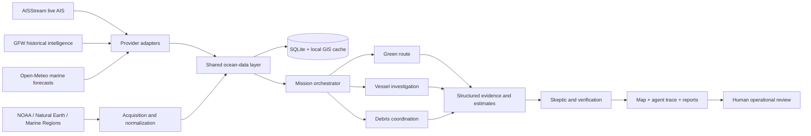

# SAMUDRARAKSHAK AI

**Autonomous Maritime Intelligence & Ocean Operations Platform**

*From maritime monitoring to autonomous ocean action.*

Built for India’s coastline. Designed for the world’s oceans.

SamudraRakshak connects three missions through one ocean-data layer: environmental shipping-route optimization, evidence-based vessel investigation, and coordination of a simulated marine-debris response fleet. It is a working local hackathon prototype built with Next.js, TypeScript and FastAPI, with real downloaded datasets and durable SQLite storage.

## Run the platform

```sh
./run.sh
```

Open **http://localhost:3000**. API documentation is at **http://localhost:8000/docs**. The script installs dependencies on first use and runs both services. Python 3.11+ and Node.js 20.9+ are required. Stop with Ctrl+C.

For separate terminals:

```sh
python3 -m venv .venv
.venv/bin/python -m pip install -r requirements.txt
.venv/bin/python -m uvicorn backend.main:app --host 127.0.0.1 --port 8000
```

```sh
npm --prefix frontend install
npm --prefix frontend run dev
```

For a production frontend, run `npm --prefix frontend run build`, then `npm --prefix frontend start`. Keep the Python service running.

## Credentials

The project reads the root `.env`. Actual credentials are excluded from source control. `.env.example` documents all settings. Only the Google Maps browser key is returned through `/api/config`. AISStream, Global Fishing Watch and Groq credentials remain server side.

- `GOOGLE_MAPS_API_KEY`: enable Maps JavaScript API. Maps 3D requires its corresponding project capability. Restrict the key to intended browser referrers and APIs.
- `AISSTREAM_API_KEY`: streams AIS PositionReport messages into the local store.
- `GFW_API_ACCESS_TOKEN`: authenticated Global Fishing Watch vessel and historical-event access.
- `LLM_API_KEY`: Groq OpenAI-compatible chat API; numerical results are computed locally.
- `LLM_MODEL`: defaults to `llama-3.3-70b-versatile`.
- `ENABLE_LIVE_AIS=false`: disable outgoing live AIS connections for an offline presentation.
- Optional Copernicus and Protected Planet credentials are documented in `.env.example`.

See **System status** for observed connection status. A configured key is not represented as a verified successful connection.

## The unified architecture



The frontend uses a cinematic map, selectable geospatial features, actual data counts, a source explorer, mission reports, command bar, an evidence graph, fleet simulation, and coordinated agent traces. The API and WebSocket share the same mission records and source-derived observations.

### Agents

The custom state-machine orchestrator coordinates fourteen specialized roles: orchestrator, green route, surveillance, behaviour, dark-vessel investigation, identity and history, jurisdiction, environment, skeptic, debris intelligence, debris drift, fleet coordination, risk fusion, and reporting. Agents pass structured outputs. Numeric engines remain authoritative; Groq can explain their verified context.

### Data and provenance

Run all accessible downloads:

```sh
.venv/bin/python scripts/acquire_data.py --all
.venv/bin/python scripts/preprocess_data.py
.venv/bin/python scripts/validate_data.py
```

The pipeline also has individual acquisition entry points for GFW, boundaries, debris, ports, and bathymetry. Downloads retain source URLs, timestamps, licenses/attribution, checksums and processing state in `data/catalog.yaml`, `data/catalog.json`, `data/download_manifest.json`, and `data/metadata/`.

- `data/raw/`: original downloaded bytes, ignored by Git.
- `data/processed/`: normalized observations and simplified map geometry.
- `data/cached/`: mission database and provider response caches, ignored by Git.
- `data/demo/`: prepared scenarios backed by the available real data.

Full-resolution regional land geometry stays on the server for intersection checks. Browser geometry is simplified. The data explorer shows actual source counts and download metadata. Consult [DATA_PROVENANCE.md](DATA_PROVENANCE.md) for source-by-source interpretation and limitations.

### Live, historical, forecast and simulation

Badges distinguish **LIVE**, **HISTORICAL**, **REAL DATA**, **MODEL FORECAST**, **COMPUTED**, **SIMULATED ASSET**, **DEMO REPLAY**, and **OFFLINE CACHE**. A historical debris concentration is not a current floating-debris report. A recorded AIS position never becomes live merely because it is animated. Forecast currents are model fields, not measured ocean currents. Replayed tracks preserve source timestamps.

## Mission 1 — Green Route

Choose two real cached ports, a cruise speed and reference fuel burn. The engine creates an offshore maritime grid, rejects candidate edges intersecting cached land, and solves shortest-distance and minimum-fuel paths on the same graph. It projects environmental current vectors onto headings and applies a transparent wave-resistance and fuel model.

Results compare nautical-mile distance, voyage time, estimated fuel, estimated CO₂, wave exposure and current assistance. Savings may honestly be zero when the shortest path is also the minimum-fuel path. Harbour approaches, pilotage, traffic separation, charted obstructions and validated draft clearances are not certified by this prototype. Unsupported routes return an explanatory error.

## Mission 2 — Ocean Sentinel

Select an actual cached vessel or live AIS observation. Rolling behaviour features include correct angular wrap, speed distribution, movement straightness, dwell, slow movement and tracking gaps. Isolation Forest is available when enough samples exist; deterministic rules provide an explainable fallback.

Historical events and identity, available jurisdiction polygons, observations, and skeptical counter-evidence form an inspectable evidence graph. Activity risk and evidence confidence are separate outputs. Missing SAR, GFW, identity, or coverage evidence remains missing; it is not fabricated. Tracking silence alone never establishes illegality. The system does not intercept or penalize vessels.

## Mission 3 — Debris Swarm

The engine applies geodesic DBSCAN to genuine observation coordinates, then projects a constant-current drift scenario with growing uncertainty. A constrained Hungarian assignment coordinates simulated collectors, accounting for distance, priority, battery reserve, capacity, and wave warnings. Land-crossing collector segments are ineligible.

Battery-drop, wave-warning, and report-trigger controls cause replanning. The fleet animation is an explicitly accelerated simulation. Historical microplastic samples define environmental survey and validation targets; they are not converted into kilograms of recoverable litter or claims of waste collected.

## Map and 3D architecture

Google Maps JavaScript is the primary connected map; optional 3D activation uses feature detection. Google authentication, network, WebGL, or 3D failures retain a real Natural Earth vector chart with matching Web Mercator coordinates. The fallback supports drag, zoom, camera easing, vessel selection, recorded-position interpolation, real current arrows, computed route drawing, observation clusters, and collector-route animation.

No fabricated ship positions are used to fill the map. Map markers and nearby data are filtered for performance. A local chart remains usable without map tiles or internet access.

## Judge demo

Use **Judge demo** in the header. The choreography moves through the ocean overview, real route optimization, vessel evidence, simulated fleet planning, agent network, and calculated impact.

- **Space**: pause/resume.
- **Left / Right**: previous/next scene.
- **R**: restart.
- **Escape**: exit.
- **⌘K / Ctrl+K**: ocean intelligence command bar.

Prepare the data before presentation. Live-provider loss leaves cached observations, forecast snapshots, geography, numeric engines, reports, and deterministic scenario selection available. The demo does not invent real vessel cases when access fails. Presenters can interact manually at any scene.

## Reports and verification

Each completed mission has an HTML report suitable for browser printing to PDF. Evidence, calculations, assumptions and source timestamps are included. Evidence details can also be downloaded as JSON.

```sh
.venv/bin/python -m pytest tests -q
npm --prefix frontend run typecheck
npm --prefix frontend run build
.venv/bin/python scripts/validate_data.py
```

## Storage and deployment

SQLite WAL is the default durable local store. `docker-compose.yml` and `backend/schema.sql` provide an optional PostgreSQL/PostGIS development foundation. Consult the implementation status below before treating optional PostGIS wiring as an active runtime capability.

This deliverable runs locally; it does not include a public production deployment, operational access controls, fleet hardware integration, or certified navigational services. For remote deployment, put authenticated HTTPS/WSS services behind a reverse proxy, restrict CORS and Maps referrers, and configure secrets in the host environment.

## Limits and future deployment

Provider permissions govern historical GFW/SAR access. Protected-area polygons requiring accepted terms or account approval are clearly reported for manual acquisition. Natural Earth is cartographic context, not a hydrographic chart. Drift lacks windage, sinking, forecast ensemble uncertainty and validated historical-time currents. Fuel estimates require vessel-specific calibration. Investigations require human verification and relevant legal context.

Designed for future integration with authorized coastal radar, VMS, satellite AIS and government maritime feeds. No operational integration with the Indian Coast Guard, Indian Navy, or government agencies is claimed.

**One ocean. One intelligence layer. Three autonomous missions.**

---

## Hackathon Submission Highlights

- **Project Name:** SamudraRakshak AI
- **Focus Area:** Autonomous Maritime Intelligence & Ocean Operations
- **Core Capabilities:**
  - **Green Route Optimization:** Weather and current-aware routing minimizing carbon emissions and fuel burn.
  - **Dark Vessel Investigation:** Automated anomaly detection, historical identity synthesis, and multi-agent cross-referencing.
  - **Marine Debris Response:** Dynamic drift modeling and autonomous recovery fleet coordination.
- **Tech Stack:** Next.js (TypeScript, Tailwind CSS), FastAPI (Python 3.12, Uvicorn, SQLite WAL), geospatial processing (GeoJSON, Open-Meteo, AISStream).

